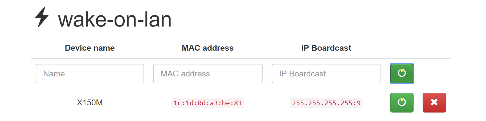

# Wake: A Wake on LAN Tool

### Usage

You can just run it directly.
```shell
./wake
```

You can use `./wake -h` for more details. And browser will pop up with a page like below:



### Acknowledge
This Project is based on [mpolden/wakeup](https://github.com/mpolden/wakeup) and [sabhiram/go-wol](https://github.com/sabhiram/go-wol).